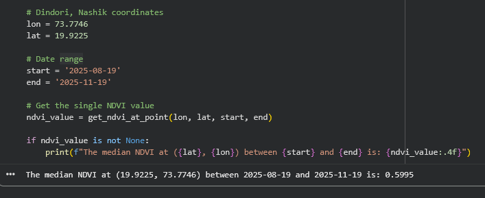
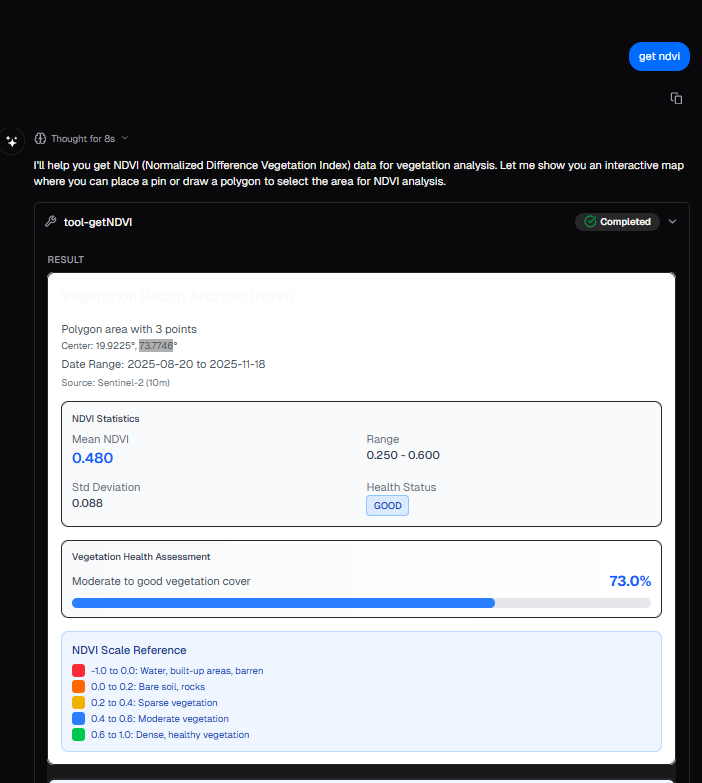
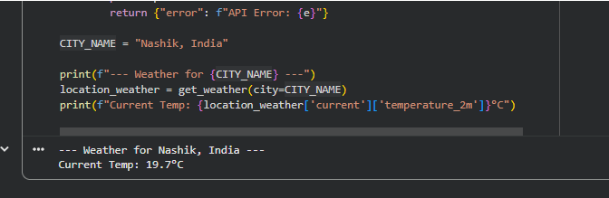
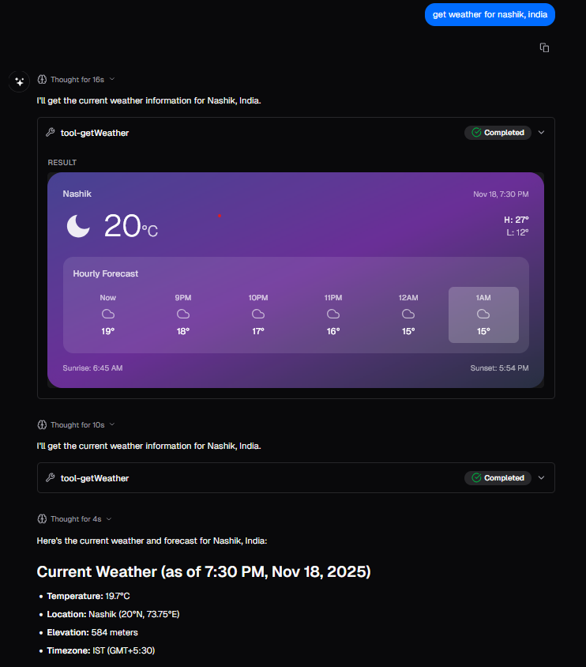
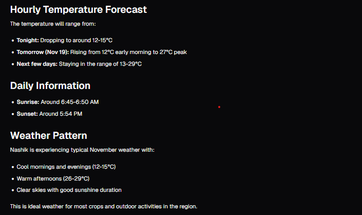
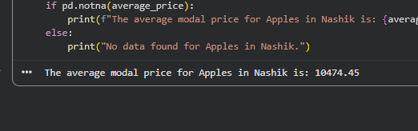
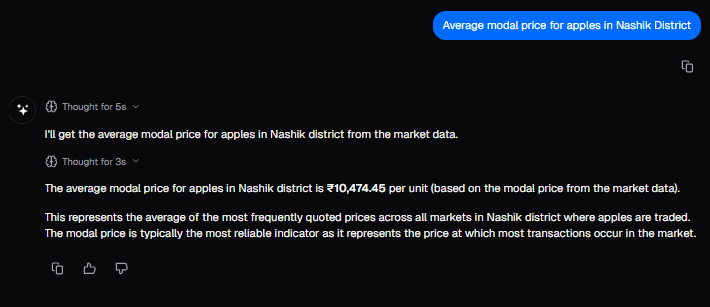

# Testing and Metric Evaluation


## Test Cases
#### This section will cover a few test cases to compare the output from the chatbot and also from a deterministic approach (Python). Screenshots will be provided, along with the code used in Python


#### Test Case 1: NDVI Retrieval 

##### Python Code:

```python
import ee
import geemap

# Ensure you have initialized the library
try:
    ee.Initialize()
except Exception as e:
    ee.Authenticate()
    ee.Initialize()

def get_ndvi_at_point(longitude, latitude, start_date, end_date):
    """
    Calculates the median NDVI for a specific point and date range.

    Args:
        longitude (float): The longitude of the point.
        latitude (float): The latitude of the point.
        start_date (str): The start date in 'YYYY-MM-DD' format.
        end_date (str): The end date in 'YYYY-MM-DD' format.

    Returns:
        float: The calculated NDVI value, or None if no data is found.
    """
    # 1. Define the point of interest
    point = ee.Geometry.Point([longitude, latitude])

    # 2. Load and filter the collection
    image = (ee.ImageCollection('COPERNICUS/S2_SR_HARMONIZED')
             .filterDate(start_date, end_date)
             .filterBounds(point)

import ee
import geemap

try:
    ee.Initialize()
except Exception as e:
    ee.Authenticate()
    ee.Initialize()

def get_ndvi_at_point(longitude, latitude, start_date, end_date):
    """
    Calculates the median NDVI for a specific point and date range.

    Args:
        longitude (float): The longitude of the point.
        latitude (float): The latitude of the point.
        start_date (str): The start date in 'YYYY-MM-DD' format.
        end_date (str): The end date in 'YYYY-MM-DD' format.

    Returns:
        float: The calculated NDVI value, or None if no data is found.
    """
    # 1. Define the point of interest
    point = ee.Geometry.Point([longitude, latitude])

    # 2. Load and filter the collection
    image = (ee.ImageCollection('COPERNICUS/S2_SR_HARMONIZED')
             .filterDate(start_date, end_date)
             .filterBounds(point)
             .filter(ee.Filter.lt('CLOUDY_PIXEL_PERCENTAGE', 20))
             .median()) # Get the median of all images in the range

    # 3. Calculate NDVI
    ndvi = image.normalizedDifference(['B8', 'B4']).rename('NDVI')

    # 4. Sample the NDVI value at the point
    # We use reduceRegion to get the value at the specified point.
    # The reducer 'ee.Reducer.first()' gets the value of the pixel
    # The 'scale' is set to 10m, the resolution of Sentinel-2's NDVI bands
    try:
        ndvi_data = ndvi.reduceRegion(
            reducer=ee.Reducer.first(),
            geometry=point,
            scale=10  # Sentinel-2 B4 and B8 are 10m resolution
        ).getInfo() # .getInfo() pulls the data from GEE server

        # 5. Extract the number from the resulting dictionary
        ndvi_value = ndvi_data.get('NDVI')

        if ndvi_value is None:
            print(f"Warning: No valid data found for ({latitude\}, {longitude\}) "
                  "in this date range. This could be due to cloud cover.")
            return None

        return ndvi_value

    except Exception as e:
        print(f"An error occurred: {e\}")
        print("This often happens if no images match your filter (e.g., 100% cloud cover).")
$0
             .filter(ee.Filter.lt('CLOUDY_PIXEL_PERCENTAGE', 20))
             .median()) # Get the median of all images in the range

    # 3. Calculate NDVI
    ndvi = image.normalizedDifference(['B8', 'B4']).rename('NDVI')

    # 4. Sample the NDVI value at the point
    # We use reduceRegion to get the value at the specified point.
    # The reducer 'ee.Reducer.first()' gets the value of the pixel
    # The 'scale' is set to 10m, the resolution of Sentinel-2's NDVI bands
    try:
        ndvi_data = ndvi.reduceRegion(
            reducer=ee.Reducer.first(),
            geometry=point,
            scale=10  # Sentinel-2 B4 and B8 are 10m resolution
        ).getInfo() # .getInfo() pulls the data from GEE server

        # 5. Extract the number from the resulting dictionary
        ndvi_value = ndvi_data.get('NDVI')

        if ndvi_value is None:
            print(f"Warning: No valid data found for ({latitude}, {longitude}) "
                  "in this date range. This could be due to cloud cover.")
            return None

        return ndvi_value

    except Exception as e:
        print(f"An error occurred: {e}")
        print("This often happens if no images match your filter (e.g., 100% cloud cover).")
        return None

# Dindori, Nashik coordinates
lon = 73.7746
lat = 19.9225

# Date range
start = '2025-08-19'
end = '2025-11-19'

# Get the single NDVI value
ndvi_value = get_ndvi_at_point(lon, lat, start, end)

if ndvi_value is not None:
    print(f"The median NDVI at ({lat}, {lon}) between {start} and {end} is: {ndvi_value:.4f}")
```

Python output:


AgroSense Output:


(values differ slightly as the AgroSense chatbot cannot do an exact point, so the Python script takes the center of the drawn polygon as the reference point)

#### Test Case 2: Weather Retrieval

##### Python Code:

```python
import requests
import json

def geocode_city(city):
    """Helper function to get coordinates for a city name."""
    try:
        url = "https://geocoding-api.open-meteo.com/v1/search"
        params = {
            "name": city,
            "count": 1,
            "language": "en",
            "format": "json"
        }
        response = requests.get(url, params=params)
        response.raise_for_status() # Check for HTTP errors
        data = response.json()

        if not data.get("results"):
            return None

        result = data["results"][0]
        return {
            "latitude": result["latitude"],
            "longitude": result["longitude"]
        }
    except Exception as e:
        print(f"Geocoding error: {e}")
        return None

def get_weather(city=None, latitude=None, longitude=None):
    """
    Get the current weather.
    Input: Provide 'city' OR ('latitude' and 'longitude').
    """
    # 1. Handle Inputs (Logic equivalent to the Zod schema)
    if city:
        coords = geocode_city(city)
        if not coords:
            return {"error": f"Could not find coordinates for '{city}'. Please check the city name."}
        latitude = coords['latitude']
        longitude = coords['longitude']
    elif latitude is None or longitude is None:
        return {"error": "Please provide either a city name or both latitude and longitude coordinates."}

    # 2. Fetch Weather Data
    try:
        url = "https://api.open-meteo.com/v1/forecast"
        params = {
            "latitude": latitude,
            "longitude": longitude,
            "current": "temperature_2m",
            "hourly": "temperature_2m",
            "daily": ["sunrise", "sunset"],
            "timezone": "auto"
        }

        response = requests.get(url, params=params)
        response.raise_for_status()
        weather_data = response.json()

        # Add city name to result if it was provided
        if city:
            weather_data['cityName'] = city

        return weather_data

    except Exception as e:
        return {"error": f"API Error: {e}"}

CITY_NAME = "Nashik, India"

print("--- Weather for <CITY_NAME> ---")
location_weather = get_weather(city=CITY_NAME)
print(f"Current Temp: {location_weather['current']['temperature_2m']}°C")

```

Python output:


AgroSense Output:




#### Test Case 3: Mandi Price Retrieval
#### Query: Average modal price for apples in Nashik District
##### Python Code:

```python
import pandas as pd

# 1. Load the dataset
# Ensure the CSV file is in the same folder as this script
df = pd.read_csv('mandi_data.csv')

# 2. Filter the data
# We look for rows where District is 'Nashik' AND Commodity is 'Apple'
# Note: We use .str.title() to handle capitalization (e.g., 'apple' vs 'Apple')
nashik_apples = df[
    (df['District_Name'].str.title() == 'Nashik') & 
    (df['Commodity_Name'].str.title().str.contains('Apple'))
]

# 3. Calculate the Average Modal Price
average_price = nashik_apples['Modal_Price'].mean()

# 4. Print the result
if pd.notna(average_price):
    print(f"The average modal price for Apples in Nashik is: {average_price:.2f}")
else:
    print("No data found for Apples in Nashik.")
```

Python output:


AgroSense Output:



## Error Analysis

There are no significant errors in the data retrieval, as shown in the testing. The NDVI values obtained from the chatbot and Python code, as mentioned, may not tally exactly due to the AgroSense chatbot only being able to get the NDVI for a polygon and not a point (although this is useful for farmers trying to get the NDVI for their entire farm and not a point), and it is not currently possible to view the exact lat/longs of each vertex of the polygon drawn. However, the NDVI value obtained from the deterministic Python code (taken from the lat/long of the center of the drawn polygon) does fall under the range that the AgroSense output shows.


##  Limitations and Possible Improvements

The limitations and the relevant improvements possible for this tool are:

1. We do not have mandi prices for the rest of India (the current implementation only has data for Nashik district), and this can be fixed by obtaining more data for key farming locations across India, through goverment listings or manual collection. This can then just be added on to the CSV file that holds all this data, and the chatbot will be able to query the data accordingly.

2. When drawing polygons for the crop data or NDVI, the map displayed is a basic Google Maps-like layer, which may not accurately represent the farmland in the area. To improve on this, we can add a satellite image layer instead of the maps layer, which would allow users to accurately pinpoint the farm location that they are trying to get data about. 