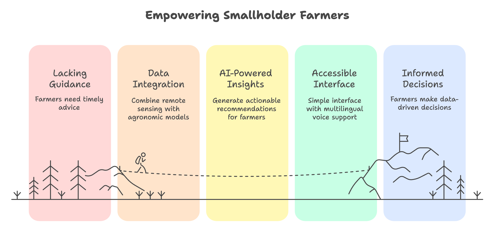
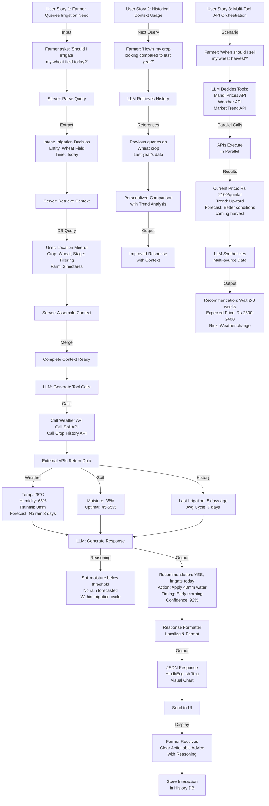

# AgroSense : Crop Lifecycle Advisory System
A Platform for Supporting Farmers Across All Phases

### 1\. Introduction & Vision

Smallholder farmers often lack timely location‑specific guidance from choosing what to plant, to managing crop growth, to deciding when and where to sell. AgroSense aims to fill this gap by integrating satellite remote sensing, historical and real-time data, generative AI, and market intelligence delivered via a simple interface with multilingual voice/text support.

*Key principles:*

* Support every stage of the crop lifecycle: planning, growth, harvest, and post-harvest decision-making.  
* Provide actionable recommendations, not just alerts or detections.  
* Enable access for farmers of all literacy levels through voice interaction in their local language(s).  
* Combine remote sensing (e.g., NDVI) with agronomic models and market data.

### 2\. Benchmark Example: 

**OneSoil and Similar Platforms**

OneSoil is a leading precision agriculture platform that uses satellite imagery, NDVI analytics, and user inputs to support field monitoring and prescription mapping.

* It detects field boundaries, classifies crop types, and provides time‑series of vegetation indices.  
* Offers maps showing growth trends, zones of weak performance, and overlays like weather or precipitation.  
* Its Pro tier supports variable rate application (VRA) maps for differential fertilizer or input dosing.  
* However, OneSoil does not currently cover pre-sowing crop selection, harvest timing advice, integrated market intelligence, nor conversational speech-based interaction for farmers.

Other similar efforts (e.g. agritech apps, chatbots for farmers) often focus on limited phases (disease diagnosis, Q\&A) rather than full lifecycle, or have scripted dialog systems rather than generative, context-aware conversation.

**Why ChatGPT and Related General AI Models Cannot Fill the Gap**

* Research published in 2024 demonstrates that GPT-based systems frequently give ambiguous, region-inappropriate, or unsafe recommendations for chemical usage, crop management, and market advice especially problematic on smallholder farms.  
* ChatGPT lacks real-time, geo-contextual integration with satellite imagery, soil, or weather data it cannot provide actionable, localized recommendations.  
* Absence of agronomic model grounding and no connection to actual mandi prices or region-specific market trends.  
* ChatGPT’s interface is not designed for Indian language voice-based accessibility, it also assumes high literacy and digital fluency.

### 3\. User Journey: How a Farmer Will Interact

This is a possible flow of how a farmer would engage with the system from start to finish:

***Onboarding & Setup***

* Farmer enters location (village or GPS) and draws or confirms field boundaries (or accepts auto‑detected ones).  
* The system collects optional background data: past crops, soil type, water access, input availability.  
* The system calibrates to local agro‑climatic zone and baseline data.

***Pre‑Sowing Planning***

* Farmer asks: “Which crop should I plant?” or “When should I sow?”  
* System analyzes historical NDVI, climate data, soil suitability, and recommends crop options and sowing windows with risk assessments.

***Sowing & Early Growth***

* System monitors initial growth, identifies zones with delayed development, and alerts the farmer to inspect those zones (e.g. for moisture, pest pressure).

***Mid‑Season Monitoring & Advisory***

* Farmer asks: “Do I need fertilizer or irrigation?” / “Could pests or disease be present?”  
* System diagnoses probable causes (nutrient stress, water stress, pests, disease) and recommends corrective actions (type, amount, timing), with explanation and confidence.  
* The system may ask clarifying questions (e.g. “Do you see any yellowing?”) to better refine advice.

***Yield Prediction & Harvest Timing***

* Farmer asks: “What yield can I expect?” / “When should I harvest?”  
* System gives yield forecasts (with uncertainty bounds), suggests optimal harvest window, warns of late-season stress risks, and allows queries like “If I delay 5 days, what is expected yield loss?”

***Post‑Harvest & Market Advisory***

* Farmer asks: “What are current mandi prices?” / “Should I sell now or wait?” / “Which market gives better return?”  
* System ingests real-time price feeds, analyzes short-term price trends, compares various market centers, and recommends sale timing or destination.  
* It can present scenario comparisons: selling now vs waiting.

***Review & Feedback Loop***

Farmer inputs actual yield, observations, and any anomalies encountered.  
System visualizes performance maps (zones of good/poor performance), compares predicted vs actual, provides lessons and suggestions for next season, and uses the data to refine its models.  
At any stage, the farmer can speak in their local language (for example, “Water is low what should I do?”) and receive a voice or text answer, supporting follow-up conversation.

### 4\. Sample Farmer Questions in English (with Multilingual Support)

Below are example questions farmers might ask in English. The system is intended to operate in multiple languages, allowing these queries (and their translations) to be asked in local speech or text.

**Pre‑Sowing / Planning**

* Which crop should I plant this season?  
* When is the best time to sow?  
* Which variety will yield well here?  
* What is the estimated cost vs profit for this crop?

**Sowing / Early Growth**

* Are the seeds germinating properly?  
* Why is growth slow in parts of the field?  
* Should I water more — is the soil too dry?  
* Mid‑Season Monitoring & Intervention  
* Is there a nutrient deficiency?  
* Could there be pests or disease?  
* How much fertilizer should I apply now?  
* How should I adjust irrigation?

**Yield Prediction & Harvest**

* “What yield can I expect from this field?  
* When should I begin harvesting?  
* If I delay harvest by a few days, what loss should I expect?

**Post‑Harvest / Market Advisory**

* What are the current mandi prices for my crop nearby?  
* Should I sell now or wait for a better price?  
* Which market gives me a better return?  
* Is the price likely to increase in the next few days/weeks?

Because the system is multilingual, these questions can also be asked in local Indian languages (e.g. Hindi, Marathi, Telugu, etc.) via voice or text, and the system will interpret and respond appropriately.

### 5\. User Stories by Lifecycle Stage
***1. Onboarding & Setup*** 
* Story 1.1 As a farmer, I want to enter my location or allow GPS detection, so that the system can automatically identify my agro-climatic zone.

* Story 1.2 As a farmer, I want to draw or confirm my field boundaries (or accept auto-detected ones), so that I can monitor only my specific fields.

* Story 1.3 As a farmer, I want to provide details like past crops, soil type, and irrigation access, so that AgroSense can give more accurate and tailored advice.

***2. Pre-Sowing Planning*** 
* Story 2.1 As a farmer, I want to ask “Which crop should I plant this season?” so that I can choose crops best suited to my soil and climate.

* Story 2.2 As a farmer, I want to know the best sowing window, so that I can optimize yield potential based on local weather patterns.

* Story 2.3 As a farmer, I want to compare expected yield and profit for different crops, so that I can make an informed decision balancing risk and reward.

***3. Sowing & Early Growth*** 
* Story 3.1 As a farmer, I want to monitor how well my crop is germinating using satellite imagery, so that I can detect uneven growth early.

* Story 3.2 As a farmer, I want to receive alerts when parts of my field show poor vegetation indices (NDVI), so that I can take corrective action before it spreads.

* Story 3.3 As a farmer, I want to speak or type “Is the soil too dry?” and get an immediate answer, so that I can adjust irrigation before damage occurs.

***4. Mid-Season Monitoring & Advisory*** 
* Story 4.1 As a farmer, I want to know whether my crop shows signs of nutrient deficiency or water stress, so that I can apply fertilizer or water precisely when needed.

* Story 4.2 As a farmer, I want AgroSense to ask clarifying questions (e.g., “Do you see yellowing?”), so that the diagnosis can become more accurate.

* Story 4.3 As a farmer, I want to receive actionable, step-by-step recommendations (e.g., quantity, timing, type of fertilizer), so that I can implement them easily and safely.

***5. Yield Forecasting & Harvest Timing*** 
* Story 5.1 As a farmer, I want to get a forecast of my expected yield with a confidence range, so that I can plan my finances and logistics.

* Story 5.2 As a farmer, I want the system to suggest the best harvest window, so that I can harvest when quality and yield are optimal.

* Story 5.3 As a farmer, I want to simulate scenarios (“If I delay harvest 5 days, what happens?”), so that I can make informed trade-offs.

***6. Post-Harvest & Market Advisory*** 
* Story 6.1 As a farmer, I want to check real-time mandi prices and nearby market trends, so that I can decide when and where to sell.

* Story 6.2 As a farmer, I want AgroSense to predict short-term price changes, so that I can plan storage or sale timing strategically.

* Story 6.3 As a farmer, I want to compare expected profit between selling now and later, so that I can make financially sound decisions.

***7. Review & Feedback Loop*** 
* Story 7.1 As a farmer, I want to enter my actual yield and field observations, so that the system can improve its accuracy for future seasons.

* Story 7.2 As a farmer, I want to visualize performance zones on my field map, so that I can understand which areas performed well or poorly.

* Story 7.3 As a farmer, I want AgroSense to summarize learnings and suggest improvements for next season, so that I continuously enhance my practices.

***8. Cross-Cutting Functional Stories*** 
* Story 8.1 — Multilingual Support As a farmer, I want to communicate in my local language via voice or text, so that I can use the app comfortably regardless of literacy level.

* Story 8.2 — Explainability As a farmer, I want the system to explain why it is giving a recommendation, so that I can trust and understand the advice.

  ---

### 6\. User Story Process Flow

---

### 7\. Detailed Request-Response Flow

#### **Phase 1: User Request & Validation (Steps 1-4)**
- **Step 1**: Farmer submits a query through the mobile/web UI (e.g., "Should I irrigate my wheat crop this week?")
- **Step 2**: UI sends HTTP API request to the REST endpoint with the query
- **Step 3**: Authentication middleware validates user credentials and permissions
- **Step 4**: Request is routed to the Query Parser for processing

#### **Phase 2: Context Retrieval from Database (Steps 5-8)**
- **Step 5**: Query Parser extracts intent and parameters from user input
- **Step 6**: Server fetches **User Profile Data** (farmer ID, location, language preferences)
- **Step 7**: Retrieves **Context Settings** (crop type, farm size, irrigation method, soil type)
- **Step 8**: Pulls **Query History** for conversation continuity and personalization

#### **Phase 3: LLM Preparation (Steps 9-10)**
- **Step 9**: Context Assembler merges all retrieved data into a unified context object
- **Step 10**: Prompt Builder constructs a detailed system prompt including:
  - User's historical interactions
  - Current context (location, crop stage, weather)
  - Available tools and their descriptions
  - Instructions for tool usage and response format

#### **Phase 4: LLM Processing & Tool Orchestration (Steps 11-17)**
- **Step 11**: LLM analyzes the query and determines which tools are needed
- **Step 12**: LLM generates structured too

### 8\. Design Implications & Notes

- Confidence & Explainability: For each advice, AgroSense will provide confidence scores and brief reasoning (e.g. “NDVI dropped by X%, likely due to moisture stress; recommended action is Y”).
- Offline / Low Connectivity: Because rural connectivity may be sporadic, certain core functions (e.g. voice recognition, local caching) should work offline or in delay-synced mode.
- Feedback Loop & Model Updating: Farmer-provided actual yield / experience data will help retrain or calibrate models across seasons.
- Localization & Language Support: Local language models, translation modules, or speech‑to‑text / text‑to-speech in supported languages to make interface natural for farmers.
