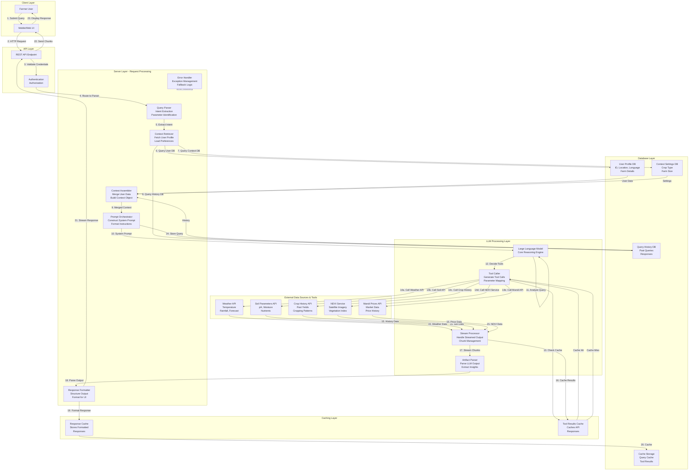

# **AgroSense Model Architecture**


### **1. Overview**

The architecture represents an LLM-powered system that provides personalized agricultural insights to farmers. It combines multiple data sources (like weather, soil, and market data) with a large language model (LLM) that interprets and delivers responses through a user-friendly interface.

### **Detailed System Architecture Diagram**



### **LLM Model Selection**

#### **Google Gemini 2.5 Pro**
- **Strengths**: 
  - Advanced multimodal reasoning (text, images, video)
  - Excellent context understanding with long context window
  - Strong performance on agricultural and domain-specific tasks
  - Cost-effective pricing
  - Native support for function calling and tool use
- **Latency**: ~1.5-2.5 seconds average response
- **Use Case**: Complex agricultural reasoning, multi-turn conversations, image analysis for crop health
- **Features**:
  - Supports 1 million token context window
  - Real-time function calling for tool orchestration
  - Structured output for consistent response formatting

---

### **Detailed Server Layer Operations**

#### **1. Query Parser Module**
```
Input: Raw user query (text/voice)
Process:
  - Tokenize and normalize input
  - Identify intent (e.g., "should I irrigate?", "what's the best crop?")
  - Extract entities (crop name, field location, time period)
  - Detect context switches or follow-ups
Output: Structured query object with intent and parameters
```

#### **2. Context Retriever Module**
```
Input: Structured query, User ID
Process:
  - Query User Profile DB: farmer_id, location (lat/long), language
  - Query Context DB: current_crop, farm_size, irrigation_method, soil_type
  - Query History DB: last_5_queries, conversation_context
  - Build context cache for current session
Output: Complete user context object
```

#### **3. Context Assembler Module**
```
Input: Raw query, User context, Historical data
Process:
  - Merge user profile with current request
  - Add historical interaction context
  - Include current crop lifecycle stage
  - Attach environmental constraints
Output: Unified context object ready for LLM
```

#### **4. Prompt Orchestrator Module**
```
Input: Assembled context, User query
Process:
  - Build system prompt with:
    * Role definition: "You are an agricultural advisor for Indian farmers"
    * Available tools and descriptions
    * Output format instructions (JSON, markdown, etc.)
    * User preferences (language, detail level)
  - Add few-shot examples for better responses
  - Include domain-specific constraints
Output: Complete system prompt sent to LLM
```

#### **5. Response Formatter Module**
```
Input: Parsed LLM output, Tool results
Process:
  - Convert raw LLM text to structured format
  - Validate recommendations against farm constraints
  - Create visual artifacts (tables, charts)
  - Localize content to user language
  - Add confidence scores to recommendations
Output: Formatted response ready for UI display
```

---

### **System Prompts Examples**

#### **System Prompt Template 1: Weather-Based Irrigation**
```
You are an expert agricultural advisor for Indian farms. The farmer has the following setup:
- Location: {latitude, longitude} - {city}, {state}
- Crop: {crop_name}, Stage: {growth_stage}
- Farm Size: {area_hectares} hectares
- Soil Type: {soil_type}, Current Moisture: {soil_moisture}%
- Last Irrigation: {days_ago} days ago
- Current Weather: {temperature}°C, Humidity: {humidity}%, Rain Forecast: {rainfall}mm

Available Tools:
1. get_weather_forecast(lat, lon, days) - Returns 7-day forecast
2. get_soil_moisture(field_id) - Current soil moisture level
3. get_crop_water_requirement(crop, stage) - Water needs for growth stage

Task: Answer the farmer's question about irrigation with actionable insights.
Response Format: JSON with keys: recommendation, reasoning, actions, warnings
```

#### **System Prompt Template 2: Market Price Advisory**
```
You are a market analyst for agricultural commodities. The farmer grows {crop_name}.
- Region: {region_name}
- Expected Harvest: {harvest_date}
- Typical Yield: {kg_per_hectare}

Available Tools:
1. get_mandi_prices(crop, region, days) - Historical prices
2. get_market_trend(crop, duration) - Price trends
3. get_competitor_prices(crop, region) - Competitor pricing

Task: Provide market insights and optimal selling strategies.
Response Format: JSON with keys: current_price, predicted_price, best_time_to_sell, risks
```


